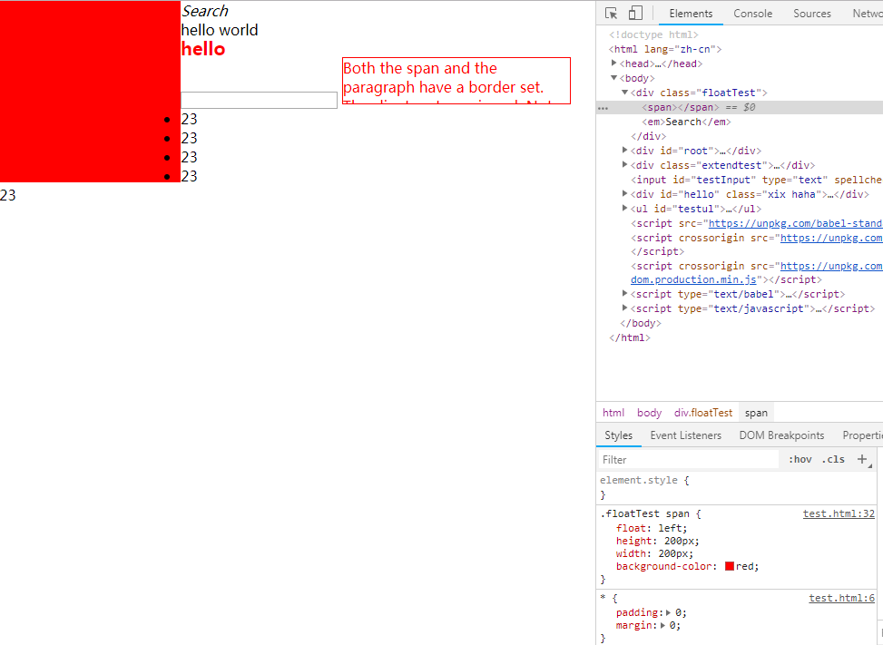

# fixed absolute float 区别

time: 2018.8.8

update: 2018.8.14

总体来说，3者都是脱离文档流，但是3者又有不同

关键词： fixed、absolute、float、 bfc

## 1 fixed

相对于用户直接看到的浏览器窗口 window 定位

## 2 absolute

相对于文档 document 定位

上面之所以还能看到，是因为滚动的不是它的父元素，而是整个document，但是它只是脱离了其父元素的文档流，还在整个 document 之中；而 fixed 是脱离整个 document

## 3 float

设计的最初目的是文字环绕效果，多用于文字环绕图片，之后也用于布局 hack 。

如果子元素全部为 float ，那么父元素不会被默认撑开。说它脱离文档流是怎么回事呢？

示例

```html
<style>
  header span { float: left; }
</style>
<header>
  <span>Home</span>
  <span>Search</span>
  <span>Button</span>
</header>
<div id="root">
  <div>hello world</div>
</div>
```

运行结果


可以看到，`hello world` 和3个 span 的 content 全部挨在一起了

既然说它脱离文档流，它脱离的是什么文档流呢？

猜想：

1. `float`: 根据上述实例，float脱离的文档流，只是脱离的它父元素的文档流，始终包裹在其父元素中
2. `position: absolute` : 脱离的文档流，是脱离的 document 文档流，包裹在其最近祖先元素表现为 relative 或 absolute 之中，或者在 document 之中，但是始终包裹在 document 文档之中
3. `position: fixed` : 脱离的文档流，是脱离的 document 文档流，但是它已经不包含在 document 之中了，它只是包含在 window 这个窗体之中

解答：

一个元素如果设置 float 属性，因为浮动意味着块布局，它会修改该元素默认的 `display` 值，绝大部分会变成 `block` ，除了2个特例：`inline-table` -> `table`， `flex` 没有影响。

### 3.1 浮动元素是如何定位的

对于猜想的定论是正确的。

当一个元素 `浮动` 之后，它会被移出正常的文档流，然后向左或者向右平移，直到碰到父元素边框或者另一个浮动的元素；

当一个元素 `absolute` 之后，它会被移出正常的文档流，然后向左上角移动或者指定坐标移动，直到碰到document边框或者祖先元素表现为absolute或者relative边框；

当一个元素 `fixed` 之后，它会被移出正常的文档流，然后向左上角移动或者指定坐标移动，直到胖到window视图边框或者祖先元素表现为fixed边框。

### 3.2 清除浮动

清除浮动是什么意思呢？默认的display属性会怎么变化？

答：由于浮动元素脱离正常文档流，不会撑开父元素，所以父元素的高度计算不会包含内部的浮动元素。如果父元素内部浮动元素的高度大于父元素，那么父元素的兄弟元素可能就会被浏览器绘制在那个浮动元素之中了，这叫 `浮动延伸` ，类似下面



该浮动元素不仅影响了父元素内部布局，而且影响了父元素的所有兄弟元素布局，这叫浮动延伸，也叫浮动破坏。

**当浮动元素超过父元素高度时**：

1. 父元素的高度不会计算该浮动元素高度
2. 父元素的兄弟元素也会被浮动影响，浮动会穿擦延伸到父元素的兄弟元素中，也会形成文字环绕效果

清除浮动，就是清除被浮动延伸造成的影响、破坏，如何 **清除浮动** 呢？

1. 给父元素的兄弟元素设置clear属性： `clear: both;` 。那么就不会出现浮动延伸了。但是如果在同一个bfc中还有其他浮动元素，就会造成其它影响。所以设置 clear 属性使用有限制，要求同一个bfc中不能有其他浮动元素
2. 将父元素构建成BFC: `overflow: hidden;` 或 `display: inline-block;` 。为什么设置这个属性就能撑开父元素呢？因为此时父元素已经被构建成了一个BFC，高度计算会包含内部浮动元素的高度。

## 4 bfc

Block Formatting Context ，块级格式上下文，是web页面的可视化css渲染组件，在它内部生成盒子，也是浮动元素与其他元素的交互限制区域。

bfc **特点**

1. 浮动定位和清除浮动只会应用于同一个bfc中的元素，不能影响到其他bfc中的元素
2. 外边距折叠只会发生在同一个bfc中的元素，不会影响到其他bfc中的元素
3. 一个bfc中的所有元素，不论怎么布局，都是包含在该bfc中

**创建bfc** 的元素例子

1. 根元素
2. 浮动元素
3. position: absolute, fixed
4. display: inline-block
5. display: table-cell, table-caption, table, table-row, inline-table
6. overflow: hidden, scroll
7. display: flex, inline-flex, grid, inline-grid

**不能创建bfc** 的元素例子

1. position: relative
2. display: block, inline
3. overflow: visible

> 由于元素的默认 display 属性为 block, inline ，不会默认创建bfc

## 5 参考文章

1. [mdn-float](https://developer.mozilla.org/zh-CN/docs/CSS/float)
2. [mdn-bfc](https://developer.mozilla.org/zh-CN/docs/Web/Guide/CSS/Block_formatting_context)
