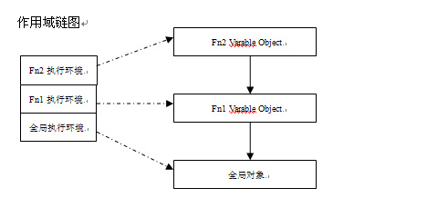

# 词法作用域

作用域定义、作用域链、静态/动态作用域

表象解释：javascript采用词法作用域

原理解释：创建执行上下文环境(js 引擎工作过程)

目录

1. 什么是作用域？
2. 作用域有哪些类型？
3. 词法作用域和动态作用域怎么区分？
4. 作用域链又是什么？是怎么定义的？
5. 词法作用域(链)可以更改吗？
6. 块级作用域

## 问：1.什么是作用域？

答：作用域就是变量和常量的起效范围，只能在该范围内访问该变量

## 问：2.作用域有哪些类型？

答：按作用范围，分为：`全局作用域`、`函数作用域`、`块级作用域(es6)`
按作用域链调用顺序，分为：`词法作用域(静态作用域)`、`动态作用域`，javascript采用词法作用域

## 问：3.词法作用域和动态作用域怎么区分？

答：之所以叫词法作用域，词，单词，就是代码编写的时候确定的作用域，动态作用域，就是在代码运行的时候确定

```javascript
/* 例1. 词法作用域 */

var value = 1;
function foo() {console.log(value);}

function bar() {var value = 2;foo();}

bar();
```

**例子分析**：最终输出1，因为javascript采用词法作用域，函数的作用域在编码创建的时候就确定了，运行foo，先查找foo函数本身有没有value，foo本身没有，沿着作用域链向上层查找，找到的上级为value=1。如果采用动态作用域，那么作用域链上级的value就应该是2了

## 问：4.作用域链又是什么？是怎么定义的？

答：作用域链为一个数组栈，包含了执行环境栈中的每个执行环境对应的变量对象。

> 因为操作作用域链只可能在函数中操作，所以这里说的作用域链就是函数的作用域链，也就是函数变量所在的执行上下文的作用域链属性

关键词：`[[scope]]`、`[[Scopes]]`、`执行上下文`、`执行上下文栈`

**创建步骤**：在函数执行前创建，执行后销毁，类似钩子函数执行时期

1. 在函数创建的时候，就为其创建了一个内部属性 `[[scope]]`，它的值为一个数组，保存祖辈执行上下文的变量对象(不是赋值，是保存对象，拥有访问权限而已，因为祖辈变量值可以改变)。
2. 在函数正式执行之前，为其创建执行上下文的时候，才将其添加到作用域链，也就是其执行上下文添加 `[[Scopes]]` 属性，依次把 `[[scope]]` 、 `函数变量对象VO`(当前函数内部的变量、函数声明)入栈，也就是添加到 `[[Scopes]]` 中，这时的 `[[Scopes]]` 就叫做 **作用域链** 。这里的然后函数才真正执行，为 `VO` 赋值，也就是函数内部变量赋值了，其变成 `AO`。
3. 执行完毕，函数的执行上下文出栈被销毁，函数执行上下文中的作用域链也被销毁了。

作用域链与执行上下文栈的对应关系(例子采用 [深入js-执行上下文](./深入js-执行上下文.md)中的例子)



**总结**：

> 1. 因为函数的内部属性 `[[scope]]` 保存了其父级执行上下文的作用域链，所以函数作用域在其创建的时候就确定了，在其他任何地方调用的值都一样
> 2. 通过本次词法作用域学习，明白了js深入的一点，需要明白js代码解释运行的详细过程。(变量提升、创建作用域链、执行上下文也就成了常事)

## 问：5.词法作用域(链)可以更改吗？

答：原则上是不可更改的，作用域链保存的就是执行上下文相关的变量信息，但是通过eval、with可以改变。eval在函数执行的时候可以动态添加变量，这里就修改了 `AO` ，所以就修改了作用域链。with就更明显了，直接修改包含代码的作用域

**延伸with**

```javascript
var obj = {
  x: 10,
  foo: function () {
    with (this) {
      var x = 20;
      var y = 30;
      console.log(y);//30
    }
  }
};
obj.foo();
console.log(obj.x);//20
console.log(obj.y);//undefined
```

with修改内部代码的作用域，多是操作对象。

**with降低性能**：js引擎通常会对我们写的js代码做静态分析，增加标识符，让我们代码运行的更快；但是不会对我们写的with里面的js代码做静态分析，不会得到优化，如果with里面执行的逻辑较多，那么就会造成严重性能浪费。

> 注意：使用with，js引擎只是不做优化，通常的变量提升还是会有的

## 6 块级作用域

存在位置：`函数内部` 和 `{}之间`

功能起效：只有在块级作用域中声明 `let` 、 `const` 才能体现它的功效

let特性：

1. 变量声明不提升，而是放入暂时性死区
2. 重复声明会报错
3. 不绑定全局变量，只在该作用域及子作用域内可访问
4. for循环对let特殊处理，创建一个隐藏的作用域

### 6.1 块级作用域 vs 非块级作用域 (var vs let&const)

1.变量提升

使用 `var` 会有变量声明提升，使用 `let | const` 不会变量提升，而是会将其放入临时死区

```javascript
var value = "global";
(function() {
    console.log(value);
    let value = 'local';
}());
{
    console.log(value);
    const value = 'local';
};
```

结果：都不会打印 global , 都会报错：`Uncaught ReferenceError: value is not defined`

分析：如果 let 和 const 换成 var，都会输出 `undefined`；js引擎在扫描代码发现生命变量时，遇到 var ，就将其提升到作用域顶部，遇到 `const | let`，则将它们放入暂时性死区。当访问暂时性死区的变量的时候，就会报错，只有执行过变脸声明语句后，才会从暂时性死区中移除。这里的 `console.log(value)` 语句，首先会去访问本作用域内的变量，会访问到暂时性死区。

2.重复声明

使用 `var` 可以重复声明，使用 `let | const` 重复声明会报错 `Uncaught SyntaxError: Identifier 'value' has already been declared`

3.绑定全局作用域

```javascript
var value = 1;
console.log(window.value); // 1
```

```javascript
let value = 1;
console.log(window.value); // undefined
```

### 6.2 块级作用域的应用

```javascript
for (let i = 0; i < 3; i++) {
  let i = 'abc';
  console.log(i);
}
console.log(i);
// abc
// abc
// abc
// Uncaught ReferenceError: i is not defined
```

为什么能成功输出3次 `abc` 呢？为什么最后一个就报错呢？

表面原因：是不是在 for 循环的 `()` 中，存在一个块级作用域，for 循环的 `{}` 相当于它的子块级作用域？

解答：let有单独的作用域。在ecmascript标准中规定，let声明在循环内部的行为，跟 var声明不同，会为let存在的for循环创建一个隐藏的作用域。

### 6.3 例子解释

```javascript
var funcs = [];
for (let i = 0; i < 3; i++) {
    funcs[i] = function () {
        console.log(i);
    };
}
funcs[0](); // 0
```

为什么使用let代替var就能正确输出i的值了呢？

答：在for循环中，每次循环，为let创建一个单独的隐藏作用域，每次循环内部函数创建时，其`[[scope]]`属性包含了该单独作用域i的引用，具有访问权限。如果是var，则其相当于全局变量var，循环内部函数创建时，其`[[scope]]`属性包含的是用全局变量i的引用，当循环结束，执行 `funcs[0]()` 的时候，访问的是全局变量i, 此时i的值已经是3了。

### 6.4 babel对let的处理

```javascript
if (false) {
    let value = 1;
}
console.log(value); // Uncaught ReferenceError: value is not defined
```

使用babel编译之后

```javascript
if (false) {
    var _value = 1;
}
console.log(value); // Uncaught ReferenceError: value is not defined
```

另一个例子

```javascript
var funcs = [];
for (let i = 0; i < 10; i++) {
    funcs[i] = function () {
        console.log(i);
    };
}
funcs[0](); // 0
```

babel怎么处理的呢？既然标准为let创建了一个隐藏的作用域，那么我就模拟创建一个作用域，babel很聪明

```javascript
var funcs = [];

var _loop = function _loop(i) {
    funcs[i] = function () {
        console.log(i);
    };
};

for (var i = 0; i < 10; i++) {
    _loop(i);
}
funcs[0](); // 0
```

每次循环，也为其创建一个单独的函数作用域，用以临时保存i的值

> 相关文章：[深入js-执行上下文](./深入js-执行上下文.md)
