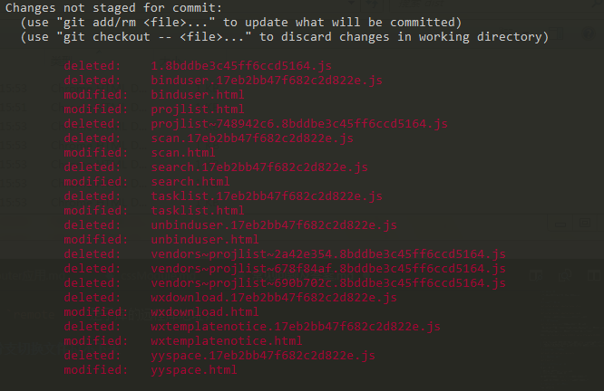

# git 常见问题及答案

这里记录我平时使用git中遇到的问题及解决方式

目录

## 1 保存用户名及密码

`git config --global credential.helper store`

## 2 不保存用户名密码

`git config --global credential.helper cache`

关闭当前 git 操作环境，重新打开，就需要用户名密码了

## 3 拉取远程新增分支

`git fetch origin`：会将远程库新增的分支拉取到本地

拉取之后，只是获取到远程分支的信息，并没有在本地创建与之关联的分支，即修改代码之后提交不到该远程分支

需要先在本地创建一个与之关联的分支，然后再提交到该远程分支

命令： `git checkout -b master20180912 remotes/http/master20180912`

说明：

1. http 是我为本地仓库设置的远程git仓库的 `http` 方式连接信息，通过 `git remote -v` 查看
2. remotes/http/master20180912 是新建的远程分支，本地不存在
3. 该命令能够在本地创建一个与新建的远程分支相关联的分支，并把该远程分支拉下来

## 4 push 时省略远程库及分支名

`git push --set-upstream origin master`

## 5 查看本地所有分支

`git branch -a`

## 6 如何同时使用多个git仓库

即 git 仓库嵌套

1. 在父 git 库里面执行 `clone` 子库
2. 修改 clone 下来的子库名称

在父库里面，对应的 `remote -v` 是父库的远程库地址；

进入子库目录，对应的 `remote -v` 是子库的远程库地址；

## 7 分支管理问题-分支切换文件拉不下来

time: 2018.9.18

描述(场景)：

本地库存在2个分支，每个分支里面嵌入的是一个git库，对应另一个远程库，即第6点嵌入的仓库。

分支管理中，修改bug时，需要同时在分支和 master 上提交这个功能，不能采用 merge 方式；

**问题**：在本地开发环境中提交代码到git库上，在分支上 pull 代码之后，提交分支代码；然后 checkout 到 master 主分支上，发现 master 上的代码已经被改变了，然后 pull 代码下来，总是提示已经是最新的部分了，但是文件又不是和git库上的一致，然后 `git status` 之后发现又有改动的地方。

**发现**：观察 git status 变化的部分，发现它是将之前分支拉下来的代码给 delete 掉了，然后换成了当前 master 分支原本的代码。

**解答**：其实文件在分支的时候就已经全部拉下来了，保存在本地分支库中，然后切换分支的时候，又把它删除了，回到目标分支原有的状态，但是这个嵌入的库受到父库的影响，必须要保持跟原本水平一致。所以切换分支的时候，父库是没有变化的，但是进入分支的子库，却发现已经变化了。  
切换后的目标分支子库之所以文件变化，因为受到父库的影响，必须变化，所以子库的文件发生了变化。

总结：嵌入的库，如果父库存在多个分支，那么这个库受到父库的所有分支的影响，父库的分支策略不变，该嵌入的库在一次更新的时候，是把代码更新下来了的。之前认为父库的每个分支对应一个嵌入的子库，现在才发现其实父库的每个分支也只对应这同一个子库。

**解决办法**：这是属于不同分支对应同一个嵌套库的问题。1. 进入子库，将子库数据删完，重新拉取；2. 进入子库，执行 `git checkout .` 将变化的部分全部取消掉，恢复子库状态就行。
