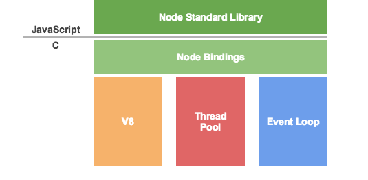

# 基本原理

架构

3大基础要点：v8、Thread Pool、Event Loop

> 归纳：nodejs做为javascript运行环境，javascript是单线程的，说它在识别、解释代码的时候(接受任务)，是单线程的，但它在从任务队列中获取执行具体任务的时候是多线程的，会将不同的任务分配给不同的线程处理

## 1 基本功能

这里作简要功能总结

其中大部分都分同步异步

1. 文件系统：能读写、创建、删除文件
2. 子进程：执行命令、运行文件
3. 进程：当前nodejs进程操作
4. udp socket：udp实现的socket
5. tcp socket: net, 实现网络功能
6. 操作系统：当前os基础信息
7. 加密：实现加密，加密算法等
8. dns：实现dns的相关功能
9. http/https
10. events

nodejs 运行机制：因为 nodejs 内置 v8 ，所以可以跑 js 代码，然后 js 可以调 node 环境的 node api；libuv 库负责 node api 的执行，将不同任务分配给不同的线程处理，这里就形成了 event loop 。

## 2 Thread Pool

## 3 event loop

nodejs 的大部分api都是属于event loop的。许多都是 `EventEmitter` 类的实例，比如 `net.Server` , `fs.ReadStream` 等，都是采用了 `eventEmitter.on()` 方法用于注册监听器，然后用 `eventEmitter.emit()` 方法用于触发事件。

关键词：`process.nextTick`  `事件队列` `非阻塞i/o`

### 3.1 nodejs 种的 event loop

time: 2018.11.09

先学习 nodejs 的事件

### 3.2 process.nextTick(func)

nodejs 事件循环，本次循环中，在调用栈任务执行完毕之后，在异步任务队列执行之前，会优先执行 nextTick 的任务，所有 nextTick 任务会在本轮事件循环中执行。并且 nextTick 任务的执行，会阻塞所有的 i/o 。

问：nextTick 内部嵌套的 nextTick 任务什么时候执行？  
答：本轮事件中执行，也是优先于任务队列的其他任务的执行。因为在执行完毕调用栈中的任务时，会优先将 nextTick 中的任务放入调用栈中，让 v8 解释执行，如果此时又遇到 nextTick 任务，那么将其加入本轮事件循环，在当前 nextTick 任务执行完毕后，又会去判断，是否还有 nextTick 任务，如果没有，才会去执行异步任务队列中的其他任务。

> nodejs 内部的 v8 引擎，不完全同于浏览器中的 v8 。

问：nodejs 的i/o指什么？什么是非 i/o ？

input、output。

i/o：读写文件、响应http请求、数据库操作等，进行额外的数据流操作。

非 i/o：执行普通任务，比如做运行计算等。

> nodejs默认i/o都是异步非阻塞io，但是也有同步阻塞i/o的api，比如 `fs.copyFile` 与 `fs.copyFileSync`

### 3.3 nodejs eventloop vs browser eventloop

这2者的事件循环机制不同，有什么区别呢？

相同点：都分任务调用栈和异步队列。

不同点：异步队列处理上，nodejs 有 `nextTick` 和 `setImmediate` 2个特殊任务，执行时机不同。

## 参考文章

1. [nodejs 官网 event loop](https://nodejs.org/en/docs/guides/event-loop-timers-and-nexttick/)
2. [阮一峰-再谈event loop](http://www.ruanyifeng.com/blog/2014/10/event-loop.html)
