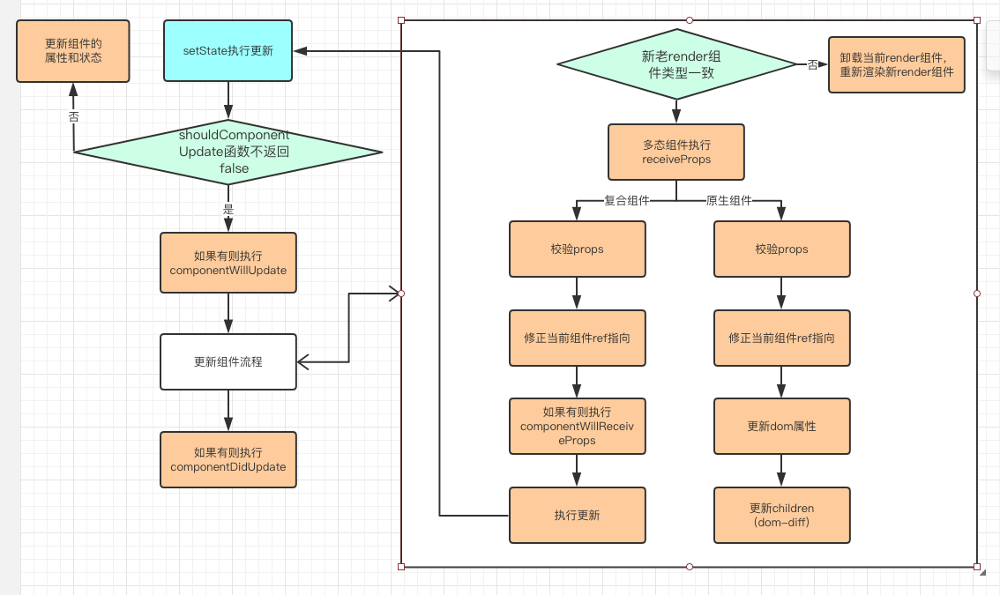

# setState

time: 2018.11.15

## 1 问题

为什么要来学习 setState 源码呢？

1. 在 setState 将数据加入队列之后，什么时机替换真实数据呢？
2. 组件内部 setState 更新数据之后，组件是如何更新的呢，从头开始做 diff 比较吗？

setState 特点

1. 不能直接使用 `this.state.hello = world` 这种方式更新 state
2. setState 是异步的
3. setState 会将参数 state 与原有 state 做浅合并

## 2 解决问题

### 2.1 在 setState 将数据加入队列之后，什么时机替换真实数据呢？

### 2.2 组件内部 setState 更新数据之后，组件是如何更新的呢，从头开始做 diff 比较吗？

time: 2018.11.15

isFinish: `true`

在 react-redux 内部，当数据变化的时候，会调用一个 `setState({})` ，不干其他事，就是鸡贼地调用 react 的 setState 方法，让 react 自己去执行更新。



可以看到，setState 是发生在组件内部的，其调用方式都是 `this.setState()` ，所以当更新数据之后，不是从头开始做 diff 比较，而是从当前组件开始，做下列过程

1. shouldComponentUpdate(): 不返回 false
2. getSnapshotBeforeUpdate(): 之前叫做 componentWillUpdate
3. 以当前组件为起点，做 diff 更新算法

```javascript
updateComponent: function (transaction) {
    // 当前render的组件
    var currentComponent = this._renderedComponent;
    // 下次render的组件
    var nextComponent = this._renderValidatedComponent();
    if (currentComponent.constructor === nextComponent.constructor) {
      if (!nextComponent.props.isStatic) {
        currentComponent.receiveProps(nextComponent.props, transaction);
      }
    } else {
      // These two IDs are actually the same! But nothing should rely on that.
      var thisID = this._rootNodeID;
      var currentComponentID = currentComponent._rootNodeID;
      currentComponent.unmountComponent();
      var nextMarkup = nextComponent.mountComponent(thisID, transaction);
      ReactComponent.DOMIDOperations.dangerouslyReplaceNodeWithMarkupByID(
        currentComponentID,
        nextMarkup
      );
      this._renderedComponent = nextComponent;
    }
}
```

## 参考

[1. 官网 setState](https://react.docschina.org/docs/react-component.html#setstate)