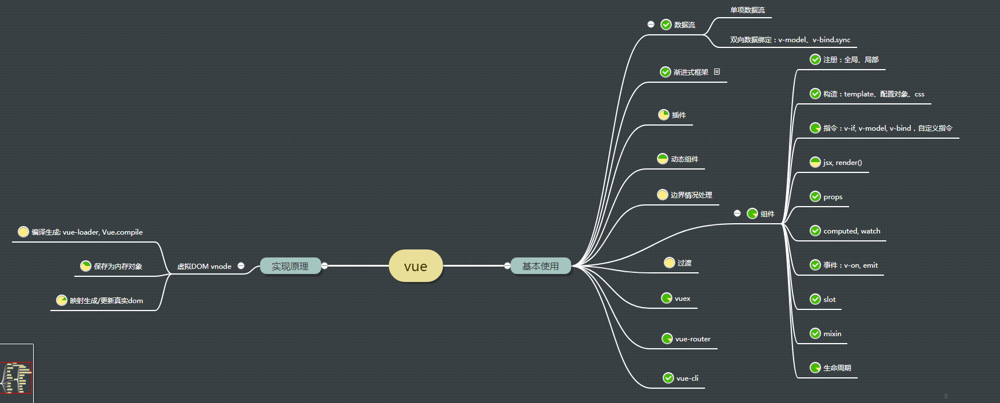

# vue 深入

time: 2019.7.4  
author: heyunjiang

[vue 基本知识](react/react-vs-vue.md) vue 基本知识使用，是总结在和 react 一起作对比



目录

[背景](#背景)  
[1 编译 compile](#1-编译-compile)  
[2 虚拟 dom](#2-虚拟-dom)  
[3 响应式系统](#3-响应式系统)  
[4 响其他 vue 知识细节点应式系统](#4-其他-vue-知识细节点)  
[5 问题](#5-问题)  
&nbsp;&nbsp;[5.1 vue 提供的预编译版本和运行时编译版本有什么不同？](#5.1-vue-提供的预编译版本和运行时编译版本有什么不同？) ✔   
&nbsp;&nbsp;[5.2 当数据发生改变时，vue 是什么时机去更新虚拟树然后更新 dom 呢？](#5.2-当数据发生改变时，vue-是什么时机去更新虚拟树然后更新-dom-呢？)  
&nbsp;&nbsp;[5.3 我们每个组件都会调用一次 new Vue 吗？](#5.3-我们每个组件都会调用一次-new-Vue-吗？) ✔  
&nbsp;&nbsp;[5.4 this.$nextTick 和 setTimeout 有什么不同？](#5.4-this.$nextTick-和-setTimeout-有什么不同？) ✔   
&nbsp;&nbsp;[5.5 vue 及其他框架，为什么要设计一个 vtree 来映射真实 dom，直接操作真实 dom 不好吗？](#5.5-vue-及其他框架，为什么要设计一个-vtree-来映射真实-dom，直接操作真实-dom-不好吗？) ✔   
&nbsp;&nbsp;[5.6 vue vnode 节点关系是怎样保存的呢？](#5.6-vue-vnode-节点关系是怎样保存的呢？) ✔  
&nbsp;&nbsp;[5.7 key 是怎么实现优化渲染的？](#5.7-key-是怎么实现优化渲染的？)  
[参考文章](#参考文章)  

## 背景

到今天为止，自己使用过 react, vue, 对这2者的基本使用都是没有什么问题，特别是组件的构造，遵循了组件复用、组件低耦合、组件规范编码、高可拓展可维护性等，自己也是写代码的一把好手了。但是也只是搬砖的，只会搬砖，按照框架文档 + API，一块砖一块砖的磊起来。  

自己使用框架，常规问题是能够解决，但是如果超出一些问题边界，比如框架本身的问题，包括性能、bug等，如果不深入框架本身，那么项目出了问题还是不能及时得到解决，即使可以在 github 上提 issue，也只是解决通用的一些问题，定制性的功能不能提供。

深入学习框架，出于以下目的：  
1. 自身好奇：用了那么久的框架，对它最终渲染在浏览器上的过程都不了解，想要了解框架实现原理，vue-loader, Vue.compile 做了什么
2. 前端技能提升：vnode 在浏览器中的存储，vtree 如何更新dom，框架应用的一些关键技术点
3. 写一个微型的 vue 框架：阅读了源码，写了文章，还是容易忘，那么写一个微型 vue 加深印象吧
4. 准备 vue 3.x 源码阅读：与 2.x 做对比
5. 面向工资编程
6. 解决第五大点自己的疑问

vue 的三大核心点：编译、虚拟dom、响应式系统

阅读版本 vue 2.x

## 1 编译 compile

从我们编写 template 到生成真实 dom，中间有一个过程，即把模板编译成 createElement 函数，这个过程叫做编译。  
虽然我们可以直接写 jsx，但是它远没有写模板来的方便，vue 为 template 提供了一些便捷写法，包括指令、特定标签等。

编译总结的[地址](./vue源码解读/compiler.md)

## 2 虚拟 dom

> 这里包含了数据 -> vtree -> rtree 的一整个过程。

虚拟 dom 总结的[地址](./vue源码解读/数据驱动.md)

关键词：$mount, _render, _update, watcher

## 3 响应式系统


## 4 其他 vue 知识细节点

1. `flow`: vue 采用 flow 做代码静态类型检查，由于 babel 和 eslint 都有相应的插件支持，改动较小
2. `function`: vue 采用 function + prototype 实现，而不是 es6 的 class 实现，为什么？
3. apply + concat + array 实现数组扁平化：`Array.prototype.concat.apply([], arr)`，利用 apply 第二个参数为数组 和 concat 参数多个实现数组的第一级扁平化，如果嵌套多级，还需要做一个递归来实现
4. for 循环内部支持 continue
5. 默认 `key` ：在数组规范化的时候会为复杂结构 normalizeArrayChildren 生成默认 key
6. Vue 是采用 function 面向对象实现，入口是在 `src/plateforms/` 下面
7. Vue 全面使用了对象是引用类型这个特点，包括 vnode 的父子节点信息关系、真实 dom 关系保存

## 5 问题

### 5.1 vue 提供的预编译版本和运行时编译版本有什么不同？

答案路径: `vue/src/platforms/web/entry-runtime-with-compiler.js`

答案简述： 
1. 在运行时编译版本中，`vue.$mount()` 方法会被重写，覆盖 `core/instance/lifecycle` 目录下的 mountComponent 方法，即会在运行的时候编译一次，而预编译版本的 mount 就是使用的 mountComponent 方法，它的 template 在 webpack 打包的时候，就通过 vue-loader 编译好了，转化成对应的方法。  
2. 重写后的 $mount 方法，在内部预先调用了 `compileToFunctions` 编译了一次模板，生成了 **render** 渲染函数，当 mountComponent 调用的时候，会判断是否有 render 方法，没有才会去调用 createEmptyVNode 赋值给 render。
3. 写法不同: 预编译版本在运行时已经不包含编译需要的代码，所以不能再写运行时编译的一些风格代码，比如：`Vue.compile()`
4. 打包后体积：预编译版本体积更小，因为不再包含编译需要的代码，只包含需要运行的 vue 代码

### 5.2 当数据发生改变时，vue 是什么时机去更新虚拟树然后更新 dom 呢？

### 5.3 我们每个组件都会调用一次 new Vue 吗？

答案：不会，new 的是继承自 Vue 的新对象  
答案简述：  
1. `new Vue`：整个 vtree 是由许多个 vnode 组合起来，每个 vnode 有3种类型：文本节点、普通节点、vue 实例节点
2. `Vue.prototype`: vue 的实例方法是定义在 Vue.prototype 原型上的，每个组件有自己的生命周期
3. `组件实例`: 每个组件都是创建一个组件实例，每个组件的原型都是通过 extend Vue 来实现的，拥有对应的原型对象 id, Vue 的 id 为 0，其它组件原型从1开始加，然后会被缓存起来。在 vm._render 阶段只是实例化 vnode，在 patch 阶段才会调用 `createComponentInstanceForVnode` 实例化每个组件对象

### 5.4 this.$nextTick 和 setTimeout 有什么不同？

答案路径：`vue/src/core/util/next-tick.js`

答案简述：nextTick 代码很短，下面是一些关键技术的总结

1. 闭包实现保存任务队列：将所有的回掉函数保存在一个数组中
2. 状态 pending: 用于表示上个nextTick任务是否在执行过程中，如果是则继续放入队列，待下次任务nextTick调用时执行(极端情况下会有 pending 为 true)
3. 空参数：如果 this.$nextTick 为空参数，则返回一个 promise 实例，再次执行时可以作为 microtask 运行
4. nextTick 内部采用多种情况实现：promise -> MutationObserver -> setImmediate -> setTimeout，只有当前一种情况不支持时，会降级采用后一种方法。所以在 chrome 高版本中，nextTick 可以理解为 promise 微任务的执行

> 如果不清楚 microtask, macrotask, 普通浏览器任务的执行顺序的，可以看我这篇文章 [深入浏览器-事件循环](../browser/深入浏览器-事件循环.md)

### 5.5 vue 及其他框架，为什么要设计一个 vtree 来映射真实 dom，直接操作真实 dom 不好吗？

1. 规范化直接操作 dom 比通过 vtree 操作 dom 更快
2. 复杂应用需要定义完整规范操作dom，很难自己实现，而 vtree 则是一套优化 dom 操作的另一种方案
3. vtree 通过定义一个数据对象，该对象比真实 dom 对象属性少很多，用户直接操作的是这个虚拟对象，不直接操作 dom，通过拦截用户的不规范化操作来达到优化性能的目的

### 5.6 vue vnode 节点关系是怎样保存的呢？

答：通过 new VNode 生成的节点中，保存了如下信息

```javascript
    this.tag = tag
    this.data = data
    this.children = children
    this.text = text
    this.elm = elm
    this.ns = undefined
    this.context = context
    this.fnContext = undefined
    this.fnOptions = undefined
    this.fnScopeId = undefined
    this.key = data && data.key
    this.componentOptions = componentOptions
    this.componentInstance = undefined
    this.parent = undefined
    this.raw = false
    this.isStatic = false
    this.isRootInsert = true
    this.isComment = false
    this.isCloned = false
    this.isOnce = false
    this.asyncFactory = asyncFactory
    this.asyncMeta = undefined
    this.isAsyncPlaceholder = false
```

所以节点之间的关系总结如下：

1. 全局一颗 vnode tree
2. 每个节点保存了父节点、后代节点之间的引用关系
3. 而具体每个对象的值又是保存在内存中

### 5.7 key 是怎么实现优化渲染的？

## 参考文章

[1 vue 官方文档](https://cn.vuejs.org/v2/guide/) 这次除了教程，也把 api 详细过一遍  
[2 vue 技术揭秘](https://ustbhuangyi.github.io/vue-analysis/)
[3 mdn mutationobserver](https://developer.mozilla.org/zh-CN/docs/Web/API/MutationObserver/observe)